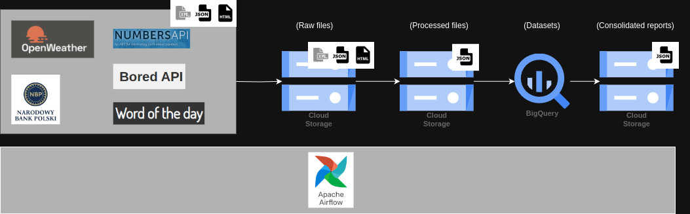
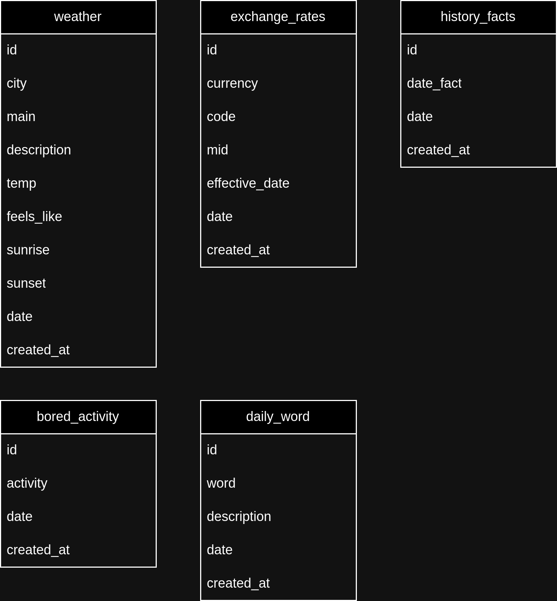

## 1. Project Overview
- Project Name: Make your own morning report.
- Project Description: This project is to prepare a daily JSON report. This report will combine various information from the internet.

## 2. About
### Data Sources

|             API source            |           Info          |     Frequency    | Data type |
|:---------------------------------:|:-----------------------:|:----------------:|:---------:|
| https://openweathermap.org/api    | Today’s weather         | real-time        | json      |
| https://api.nbp.pl/#kursySingle   | Kurs EUR to PLN         | weekdays at ~8AM | json      |
| http://numbersapi.com/#42         | History on today’s date | random           | txt/html  |
| https://wordsmith.org/            | Word of the day         | daily            | xml       |
| https://bored-api.appbrewery.com/ | Bored activity          | random           | json      |

### Data Transformations
1. I extracted the data in the original data type. I kept all the information.
2. Then, I transformed the data to JSON format. I kept only the information I was interested in.

### Target Systems
BigQuery database + JSON file.

## 3. Architecture
### High-level Architecture

### BigQuery database schema

(for data types, etc., see the [bigqueryschema.sql](bigquery_queries/BigQuerySchema.sql) file)
### Technologies Used

| Technology            | Used for:                                                                                                                                                                |
|-----------------------|--------------------------------------------------------------------------------------------------------------------------------------------------------------------------|
| Google Cloud Platform | 1. Cloud Storage for storing raw, processed & output files, 2. BigQuery as a database                                                                                           |
| Airflow               | orchestration                                                                                                                                                            |
| Python                | 1. overall setup  google.cloud storage, bigquery for interacting with GCP resources, 2. airflow.models variable for extracting variables from Airflow & keeping the code clean |

(I skipped some basic technologies & libraries, like datetime, request.get, etc.)

## 4. Step-by-Step Guide
### Prerequisites:
- Airflow set up on local machine or in docker container
- Google Cloud Platform:
  - free trial account is sufficient
  - User with owner role
  - Enabled APIs: Storage API & BigQuery API

### Configuration:
#### In GCP:
1. configure your ADC credentials ([instruction](https://cloud.google.com/docs/authentication/provide-credentials-adc#google-idp)):
2. Create Buckets: 
    1. working-files-morning-report (for raw & processed files)
    2. morning-report (for final files)
3. In BigQuery:
    1. Create dataset
    2. Create all tables (just execute queries from the [bigqueryschema.sql](bigquery_queries/BigQuerySchema.sql) file)

#### In Airflow:
1. Set up variables in Airflow (use the [variables.json](variables/variables.json) file, change values to match your names).
2. Copy DAGs from the [/dags](dags) folder to your local folder.
3. Activate all DAGs.

### Execution:
Your DAGs will run based on your "cron_interval" variable from the [variables.json](variables/variables.json) file. If you want different times, just change it. \
Final DAG - [morning_report.py](dags/morning_report.py) - will run only once all the other DAGs are successfully completed.